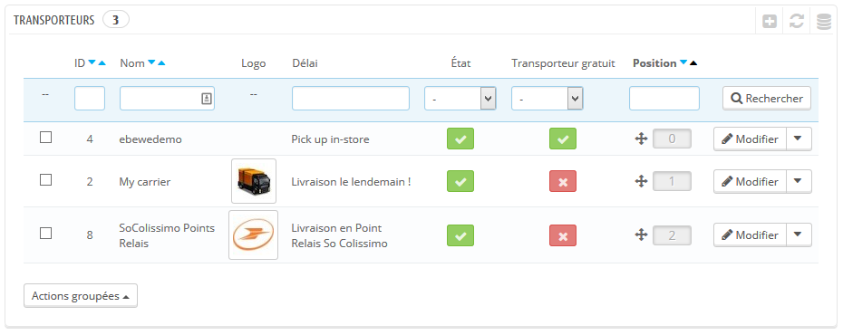
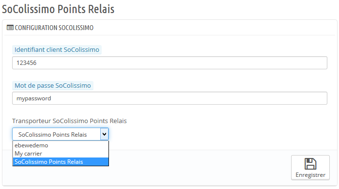
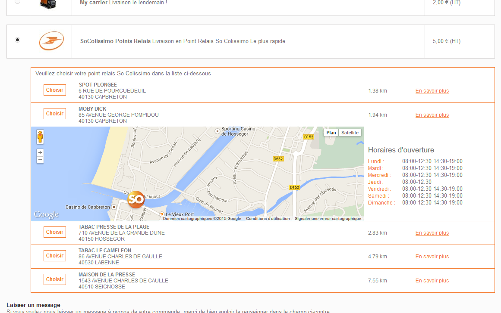

Configuration
=============

La configuration se fait en deux étapes.

Créer un nouveau transporteur
^^^^^^^^^^^^^^^^^^^^^^^^^^^^^

Tout d'abord, vous devez créer un nouveau transport que vous pouvez nommer par exemple "So Colissimo Points Relais".

Configurez le normalement, comme vous configureriez un transporteur classique avec ses tranches de prix ou tranches de poids selon vos besoins.

Ensuite, sur la page de configuration du module
^^^^^^^^^^^^^^^^^^^^^^^^^^^^^^^^^^^^^^^^^^^^^^^

Renseignez vos identifiants à votre compte SoColissimo. Il s'agit de l'identifiant et du mot de passe que vous utilisez pour vous connecter à votre compte sur www.colissimo.fr.

Sélectionnez le transporteur que vous souhaitez utiliser pour afficher les Points Relais So Colissimo sur votre boutique.

Dans cet exemple, nous utiliserons celui que nous venons de créer: "So Colissimo Points Relais".

Cliquez sur le bouton Enregistrer.

La configuration est terminée, quand vos clients arriveront sur la page de choix du transporteur, ils auront désormais la possibilité de sélectionner un Point Relais So Colissimo.

