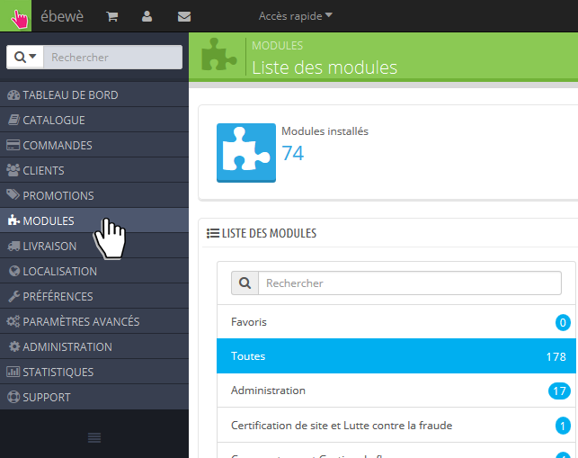
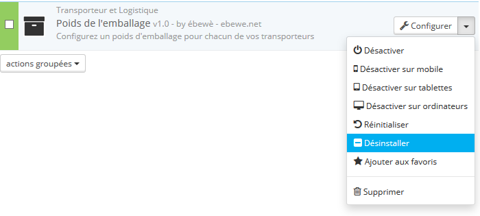

Uninstallation
==============

To uninstall the module, follow these steps:

First, go to Modules page in your Back-Office
^^^^^^^^^^^^^^^^^^^^^^^^^^^^^^^^^^^^^^^^^^^^^

Search for So Colissimo Points Relais module
^^^^^^^^^^^^^^^^^^^^^^^^^^^^^^^^^^^^^^^^^^^^

Click on the arrow next to Configure button
^^^^^^^^^^^^^^^^^^^^^^^^^^^^^^^^^^^^^^^^^^^

* Click on Disable to temporarly disable the module. It will not be uninstalled.
* Click on Uninstall to uninstall the module. It will be uninstalled but still on your server.
* Click on Delete to uninstall and delete the module. It will be uninstalled and deleted from your server.
